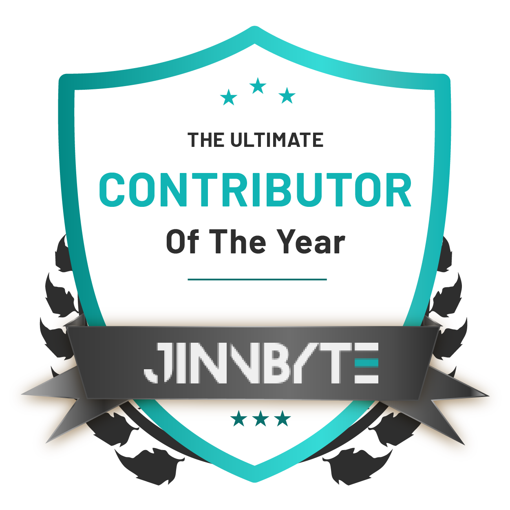

# Hi, I'm Syed Hamza Ali

The world can be an overwhelming place, so I help make people’s life easier by developing websites and applications as a software developer.

Let me tell you a bit about myself 

- 🖥️ I have been working for JinnByte Private Limited as a Backend Developer
- 🖨️ I have worked in .Net MVC, .Net Core, and js and databases which include MS SQL, phpMyAdmin and etc
- 🧑‍💻 Besides having great skills, I believe learning must never end! I have learned many new skills such as Team Work, Management, and Relation Building
- 🎾 In my free time, I am a gaming geek, I love to play pubg and Story Mode Games
- ⛰️ Love exploring off-beat hikes and peaks in Northern Pakistan.

<h3>💻 GitHub Profile Stats</h3>

  

    
  

  

    
  

<b>Note:</b> Top languages is only a metric of the languages my public code consists of and doesn't reflect experience or skill level.
